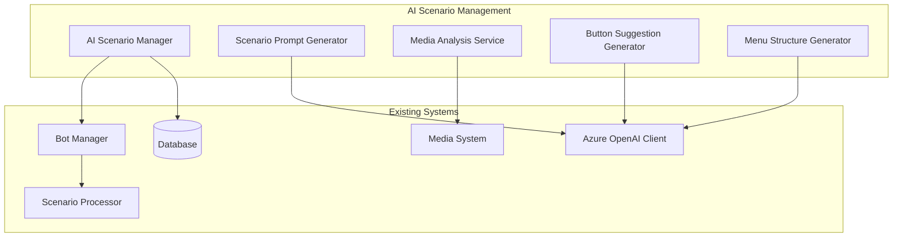

# AI Scenario Management Specification

## Overview

This specification defines an AI-powered scenario management system that enables automatic generation of bot conversation flows, media attachments, Telegram buttons, and menu structures using Large Language Models (LLMs). The system extends the existing bot management framework to provide intelligent scenario creation, modification, and optimization capabilities.

## Objectives

1. **Automated Scenario Generation**: Generate complete bot scenarios from example templates or natural language descriptions
2. **Intelligent Media Suggestions**: Automatically suggest appropriate media content for each conversation step
3. **Dynamic Button Generation**: Create contextually relevant buttons and quick replies for Telegram interactions
4. **Menu System Automation**: Generate hierarchical menu structures with appropriate navigation flows
5. **Multi-Language Support**: Generate scenarios in multiple languages with cultural adaptation
6. **A/B Testing Integration**: Create scenario variations for performance optimization

## Current Architecture Integration

### Existing Components

The AI Scenario Management system builds upon:

- **Bot Manager** (`src/bot_manager/`): Existing scenario processing and dialog management
- **Azure OpenAI Integration** (`src/integrations/ai_tools/azure_openai/`): AI service infrastructure
- **Scenario Format** (documented in `docs/modules/bot-management/scenario-format.md`): JSON-based scenario structure
- **Media System**: File storage and management for bot media assets

### Integration Points



## Core Components

### 1. AI Scenario Manager

**Location**: `src/integrations/ai_tools/scenario_manager/`

**Responsibilities**:
- Orchestrate scenario generation workflow
- Manage AI prompt templates and context
- Handle scenario validation and optimization
- Coordinate with existing bot management system

**Key Methods**:
```python
async def generate_scenario_from_example(
    example_scenario: Dict[str, Any],
    target_domain: str,
    customization_params: Dict[str, Any]
) -> Dict[str, Any]

async def generate_scenario_from_description(
    description: str,
    target_platform: List[str],
    language: str = "ru"
) -> Dict[str, Any]

async def optimize_scenario(
    scenario: Dict[str, Any],
    performance_metrics: Dict[str, Any]
) -> Dict[str, Any]
```

### 2. Scenario Prompt Generator

**Location**: `src/integrations/ai_tools/scenario_manager/prompt_generator.py`

**Responsibilities**:
- Generate contextual prompts for different scenario elements
- Manage prompt templates for various use cases
- Handle prompt optimization and versioning

**Prompt Categories**:
- **Structure Generation**: Create scenario flow and step sequences
- **Content Generation**: Generate message text with appropriate tone and style
- **Conditional Logic**: Create conditional branches and decision trees
- **Variable Management**: Define and map scenario variables

### 3. Media Analysis Service

**Location**: `src/integrations/ai_tools/scenario_manager/media_service.py`

**Responsibilities**:
- Analyze scenario content to suggest appropriate media
- Generate media descriptions and requirements
- Integrate with existing media storage system
- Provide media optimization suggestions

**Features**:
- Context-aware media suggestions
- Brand guideline compliance
- Accessibility considerations
- Multi-format support (images, videos, documents)

### 4. Button Suggestion Generator

**Location**: `src/integrations/ai_tools/scenario_manager/button_generator.py`

**Responsibilities**:
- Generate contextually appropriate button text and values
- Create platform-specific button configurations
- Handle emoji integration and visual design
- Support accessibility requirements

**Button Types**:
- Quick replies for common responses
- Action buttons for specific functions
- Navigation buttons for menu systems
- Custom buttons for unique interactions

### 5. Menu Structure Generator

**Location**: `src/integrations/ai_tools/scenario_manager/menu_generator.py`

**Responsibilities**:
- Create hierarchical menu structures
- Generate navigation flows between menu items
- Handle deep-linking and state management
- Optimize menu organization for user experience

**Menu Features**:
- Multi-level navigation
- Context-sensitive options
- User role-based customization
- Platform-specific adaptations

## Prompt Engineering Framework

### Template Management

**Location**: `src/integrations/ai_tools/scenario_manager/templates/`

**Structure**:
```
templates/
├── scenario_generation/
│   ├── base_structure.txt
│   ├── onboarding_flow.txt
│   ├── support_conversation.txt
│   └── custom_domain.txt
├── content_generation/
│   ├── welcome_messages.txt
│   ├── error_handling.txt
│   └── completion_messages.txt
├── button_generation/
│   ├── navigation_buttons.txt
│   ├── action_buttons.txt
│   └── confirmation_buttons.txt
└── media_suggestions/
    ├── educational_content.txt
    ├── brand_media.txt
    └── interactive_elements.txt
```

### Prompt Template Example

```yaml
# scenario_generation/onboarding_flow.txt
system_prompt: |
  You are an expert bot conversation designer for restaurant onboarding systems.
  Generate a comprehensive onboarding scenario based on the provided example.
  
  Requirements:
  - Follow the exact JSON format specified
  - Include appropriate media suggestions
  - Create engaging button text with emojis
  - Ensure logical flow between steps
  - Include conditional logic where appropriate
  - Support the specified language and cultural context

user_prompt: |
  Create an onboarding scenario for {{domain}} based on this example:
  
  {{example_scenario}}
  
  Customize for:
  - Target audience: {{target_audience}}
  - Company culture: {{company_culture}}
  - Required information: {{required_fields}}
  - Platform: {{platform}}
  - Language: {{language}}
  
  Generate a complete scenario with all steps, media suggestions, and button configurations.
```

### Context Management

**Dynamic Context Variables**:
- `{{company_brand}}`: Brand guidelines and tone of voice
- `{{user_persona}}`: Target user characteristics
- `{{platform_capabilities}}`: Platform-specific features
- `{{cultural_context}}`: Regional and cultural adaptations
- `{{performance_history}}`: Historical scenario performance data

## API Specifications

### REST Endpoints

```python
# Scenario Generation
POST /api/v1/ai-scenarios/generate
{
  "method": "from_example|from_description",
  "source": {
    "example_scenario": {...},  # for from_example
    "description": "text",      # for from_description
  },
  "parameters": {
    "domain": "restaurant_onboarding",
    "platform": ["telegram"],
    "language": "ru",
    "target_audience": "new_employees",
    "customizations": {...}
  }
}

# Media Suggestions
POST /api/v1/ai-scenarios/suggest-media
{
  "scenario_step": {...},
  "context": {
    "step_purpose": "welcome|instruction|confirmation",
    "brand_guidelines": {...},
    "target_emotion": "welcoming|informative|exciting"
  }
}

# Button Generation
POST /api/v1/ai-scenarios/generate-buttons
{
  "step_context": {...},
  "expected_input_type": "selection|navigation|action",
  "options": ["option1", "option2", "option3"],
  "platform": "telegram",
  "language": "ru"
}

# Menu Structure
POST /api/v1/ai-scenarios/generate-menu
{
  "content_sections": [...],
  "navigation_depth": 2,
  "platform": "telegram",
  "user_roles": ["employee", "manager"],
  "language": "ru"
}
```

### Response Formats

```json
{
  "status": "success|error",
  "data": {
    "scenario": {...},
    "media_suggestions": [...],
    "optimization_notes": [...],
    "validation_results": {...}
  },
  "metadata": {
    "generation_time": "2023-12-01T10:00:00Z",
    "ai_model": "gpt-4-turbo",
    "confidence_score": 0.95,
    "suggestions_count": 15
  }
}
```

## Database Schema Extensions

### AI Scenario Templates

```sql
CREATE TABLE ai_scenario_templates (
    id UUID PRIMARY KEY DEFAULT gen_random_uuid(),
    name VARCHAR(255) NOT NULL,
    domain VARCHAR(100) NOT NULL,
    description TEXT,
    template_data JSONB NOT NULL,
    prompt_templates JSONB NOT NULL,
    created_at TIMESTAMP WITH TIME ZONE DEFAULT NOW(),
    updated_at TIMESTAMP WITH TIME ZONE DEFAULT NOW(),
    is_active BOOLEAN DEFAULT true,
    usage_count INTEGER DEFAULT 0,
    success_rate DECIMAL(5,2) DEFAULT 0.0
);
```

### AI Generation History

```sql
CREATE TABLE ai_generation_history (
    id UUID PRIMARY KEY DEFAULT gen_random_uuid(),
    template_id UUID REFERENCES ai_scenario_templates(id),
    generated_scenario_id UUID REFERENCES bot_scenarios(id),
    generation_method VARCHAR(50) NOT NULL, -- 'from_example', 'from_description'
    input_data JSONB NOT NULL,
    output_data JSONB NOT NULL,
    generation_time INTERVAL NOT NULL,
    model_used VARCHAR(100) NOT NULL,
    confidence_score DECIMAL(5,2),
    user_id UUID,
    created_at TIMESTAMP WITH TIME ZONE DEFAULT NOW()
);
```

### Media Suggestions

```sql
CREATE TABLE ai_media_suggestions (
    id UUID PRIMARY KEY DEFAULT gen_random_uuid(),
    scenario_step_id VARCHAR(255) NOT NULL,
    media_type VARCHAR(50) NOT NULL, -- 'image', 'video', 'document'
    suggestion_text TEXT NOT NULL,
    context_tags JSONB,
    priority_score INTEGER DEFAULT 5,
    implementation_status VARCHAR(50) DEFAULT 'suggested', -- 'suggested', 'approved', 'implemented', 'rejected'
    created_at TIMESTAMP WITH TIME ZONE DEFAULT NOW(),
    approved_by UUID,
    implemented_at TIMESTAMP WITH TIME ZONE
);
```

## Implementation Phases

### Phase 1: Core Infrastructure (Sprint 1-2)

**Deliverables**:
- AI Scenario Manager basic implementation
- Integration with existing Azure OpenAI client
- Basic prompt template system
- Simple scenario generation from examples

**Tasks**:
1. Create base AI Scenario Manager class
2. Implement prompt template loading system
3. Add scenario generation API endpoints
4. Create database schema for templates and history
5. Basic validation and error handling

### Phase 2: Enhanced Generation (Sprint 3-4)

**Deliverables**:
- Media suggestion system
- Button generation capabilities
- Menu structure automation
- Advanced prompt engineering

**Tasks**:
1. Implement Media Analysis Service
2. Create Button Suggestion Generator
3. Develop Menu Structure Generator
4. Enhanced prompt templates with context variables
5. Performance metrics collection

### Phase 3: Optimization & Intelligence (Sprint 5-6)

**Deliverables**:
- A/B testing integration
- Performance-based optimization
- Multi-language support
- Advanced analytics

**Tasks**:
1. Implement scenario performance tracking
2. Create optimization algorithms
3. Add multi-language prompt templates
4. Build analytics dashboard
5. A/B testing framework integration

## Quality Assurance

### Validation Framework

**Scenario Validation**:
- JSON schema compliance
- Logical flow consistency
- Platform capability verification
- Content appropriateness checks
- Accessibility requirements compliance

**Content Quality Checks**:
- Brand guideline adherence
- Tone of voice consistency
- Cultural sensitivity validation
- Language accuracy verification
- User experience best practices

### Testing Strategy

**Unit Tests**:
- Individual component functionality
- Prompt template rendering
- API endpoint behavior
- Database operations

**Integration Tests**:
- End-to-end scenario generation
- Cross-component data flow
- External API interactions
- Performance benchmarks

**User Acceptance Tests**:
- Generated scenario quality
- User experience evaluation
- Platform-specific functionality
- Multi-language accuracy

## Performance Considerations

### Optimization Strategies

**Caching**:
- Template caching for frequently used prompts
- Generated scenario caching with invalidation
- Media suggestion caching by context
- API response caching for similar requests

**Async Processing**:
- Background scenario generation for complex requests
- Parallel processing of scenario components
- Queue-based media suggestion generation
- Batch processing for multiple scenarios

**Resource Management**:
- AI model usage optimization
- Token usage monitoring and limits
- Request rate limiting and throttling
- Graceful degradation for high load

### Monitoring & Analytics

**Key Metrics**:
- Scenario generation success rate
- Average generation time
- User satisfaction scores
- Media suggestion adoption rate
- Button click-through rates

**Alerting**:
- Generation failure rates above threshold
- API response time degradation
- AI model quota usage warnings
- Content quality score drops

## Security & Privacy

### Data Protection

**Sensitive Data Handling**:
- Encryption of stored prompts and templates
- Secure transmission of generation requests
- Data retention policies for generation history
- User consent management for AI-generated content

**Access Control**:
- Role-based access to AI generation features
- Audit logging for all AI operations
- Template modification permissions
- Generated content approval workflows

### Compliance

**Content Moderation**:
- Automated content safety checks
- Human review workflows for sensitive domains
- Bias detection and mitigation
- Cultural sensitivity validation

## Future Enhancements

### Advanced AI Capabilities

**Planned Features**:
- Voice conversation scenario generation
- Visual scenario flow design
- Real-time scenario adaptation based on user behavior
- Predictive scenario optimization
- Cross-platform scenario synchronization

**Research Areas**:
- Emotion-aware conversation design
- Personalized scenario generation
- Advanced natural language understanding
- Multi-modal interaction scenarios
- AI-powered conversation analytics

### Integration Opportunities

**External Systems**:
- CRM integration for personalized scenarios
- Analytics platforms for performance tracking
- Content management systems for media libraries
- Translation services for multi-language support
- Customer feedback systems for optimization

This specification provides a comprehensive foundation for implementing AI-powered scenario management while maintaining compatibility with the existing bot management system and leveraging the current Azure OpenAI infrastructure.