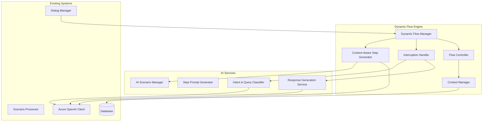

# Dynamic AI Scenario Flow Management

## Overview

This specification extends the existing AI Scenario Management system to provide real-time, dynamic step generation during conversations while maintaining flow coherence and handling user interruptions gracefully. The system generates the next conversation step on-the-fly based on context, user behavior, and current conversation state.

## Key Objectives

1. **Dynamic Step Generation**: Generate next steps in real-time during active conversations
2. **Flow Continuity**: Maintain logical conversation flow while adapting to dynamic content
3. **Interruption Handling**: Address off-topic questions and return to the main flow seamlessly
4. **Context Preservation**: Keep track of conversation context and user intent
5. **Personalization**: Adapt conversation flow based on user responses and behavior

## Architecture Overview



## Core Components

### 1. Dynamic Flow Manager

**Location**: `src/integrations/ai_tools/dynamic_flow/flow_manager.py`

The central orchestrator for dynamic scenario management.

```python
class DynamicFlowManager:
    def __init__(
        self,
        ai_client: AzureOpenAIClient,
        context_manager: ContextManager,
        interruption_handler: InterruptionHandler
    ):
        self.ai_client = ai_client
        self.context_manager = context_manager
        self.interruption_handler = interruption_handler
        
    async def process_user_input(
        self,
        bot_id: UUID,
        platform: str,
        platform_chat_id: str,
        user_input: str,
        dialog_state: Dict[str, Any]
    ) -> Dict[str, Any]:
        """
        Process user input and determine next step dynamically
        """
        # Classify intent and determine if this is an interruption
        intent_analysis = await self._analyze_user_intent(
            user_input, dialog_state
        )
        
        if intent_analysis["is_interruption"]:
            return await self._handle_interruption(
                user_input, dialog_state, intent_analysis
            )
        
        # Generate next step dynamically based on context
        return await self._generate_next_step(
            user_input, dialog_state, intent_analysis
        )
```

### 2. Context-Aware Step Generator

**Location**: `src/integrations/ai_tools/dynamic_flow/step_generator.py`

Generates conversation steps dynamically based on current context and user behavior.

```python
class ContextAwareStepGenerator:
    async def generate_next_step(
        self,
        current_context: Dict[str, Any],
        user_input: str,
        conversation_history: List[Dict[str, Any]],
        scenario_template: Dict[str, Any]
    ) -> Dict[str, Any]:
        """
        Generate the next conversation step based on context
        """
        
        # Build context-aware prompt
        prompt = await self._build_step_generation_prompt(
            current_context=current_context,
            user_input=user_input,
            history=conversation_history,
            template=scenario_template
        )
        
        # Generate step using AI
        response = await self.ai_client.send_chat_completion(
            messages=[
                {"role": "system", "content": prompt["system"]},
                {"role": "user", "content": prompt["user"]}
            ],
            temperature=0.7,
            max_tokens=1500
        )
        
        # Parse and validate generated step
        return await self._parse_and_validate_step(response)
```

### 3. Interruption Handler

**Location**: `src/integrations/ai_tools/dynamic_flow/interruption_handler.py`

Manages off-topic questions and conversation interruptions.

```python
class InterruptionHandler:
    async def handle_interruption(
        self,
        user_question: str,
        current_context: Dict[str, Any],
        conversation_state: Dict[str, Any]
    ) -> Dict[str, Any]:
        """
        Handle user interruption and generate appropriate response
        """
        
        # Classify the type of interruption
        interruption_type = await self._classify_interruption(
            user_question, current_context
        )
        
        if interruption_type["category"] == "faq":
            return await self._handle_faq_question(
                user_question, interruption_type
            )
        elif interruption_type["category"] == "clarification":
            return await self._handle_clarification_request(
                user_question, current_context
            )
        elif interruption_type["category"] == "objection":
            return await self._handle_objection(
                user_question, current_context
            )
        else:
            return await self._handle_general_question(
                user_question, current_context
            )
```

### 4. Flow Controller

**Location**: `src/integrations/ai_tools/dynamic_flow/flow_controller.py`

Manages flow transitions and ensures conversation coherence.

```python
class FlowController:
    async def determine_flow_action(
        self,
        user_input: str,
        current_step: Dict[str, Any],
        conversation_context: Dict[str, Any]
    ) -> Dict[str, Any]:
        """
        Determine what action to take in the conversation flow
        """
        
        flow_analysis = await self._analyze_flow_requirements(
            user_input, current_step, conversation_context
        )
        
        return {
            "action": flow_analysis["recommended_action"],  # continue, branch, return, interrupt
            "next_step": flow_analysis.get("next_step"),
            "branch_reason": flow_analysis.get("branch_reason"),
            "return_point": flow_analysis.get("return_point")
        }
```

## Dynamic Step Generation Process

### 1. Input Analysis

```python
async def _analyze_user_intent(
    self,
    user_input: str,
    dialog_state: Dict[str, Any]
) -> Dict[str, Any]:
    """
    Analyze user input to determine intent and conversation direction
    """
    
    analysis_prompt = f"""
    Analyze the following user input in the context of an onboarding conversation:
    
    User Input: "{user_input}"
    Current Step: {dialog_state.get('current_step', 'unknown')}
    Expected Input Type: {dialog_state.get('expected_input_type', 'any')}
    
    Determine:
    1. Is this a direct response to the current question? (yes/no)
    2. Is this an interruption/side question? (yes/no)
    3. What is the user's intent? (answer, question, clarification, objection, etc.)
    4. Confidence level (0-1)
    5. Suggested next action (continue, address_question, clarify, etc.)
    
    Respond in JSON format.
    """
    
    response = await self.ai_client.send_chat_completion(
        messages=[{"role": "user", "content": analysis_prompt}],
        temperature=0.3
    )
    
    return json.loads(response)
```

### 2. Dynamic Step Creation

```python
async def _generate_next_step(
    self,
    user_input: str,
    dialog_state: Dict[str, Any],
    intent_analysis: Dict[str, Any]
) -> Dict[str, Any]:
    """
    Generate the next conversation step dynamically
    """
    
    # Build context for step generation
    context = await self._build_generation_context(
        user_input, dialog_state, intent_analysis
    )
    
    generation_prompt = f"""
    You are an expert conversation designer creating the next step in an onboarding flow.
    
    Context:
    - Company: {context['company_info']}
    - Current onboarding stage: {context['onboarding_stage']}
    - User profile: {context['user_profile']}
    - Previous responses: {context['previous_responses']}
    - Current question: {context['current_question']}
    - User answer: "{user_input}"
    
    Generate the next conversation step that:
    1. Acknowledges the user's response appropriately
    2. Builds naturally on the conversation flow
    3. Moves toward the onboarding objectives
    4. Includes appropriate media suggestions if relevant
    5. Provides engaging button options
    
    Return a complete step in the standard scenario format.
    """
    
    response = await self.ai_client.send_chat_completion(
        messages=[{"role": "user", "content": generation_prompt}],
        temperature=0.7,
        max_tokens=1500
    )
    
    return await self._parse_generated_step(response)
```

### 3. Interruption Management

```python
async def _handle_interruption(
    self,
    user_input: str,
    dialog_state: Dict[str, Any],
    intent_analysis: Dict[str, Any]
) -> Dict[str, Any]:
    """
    Handle user interruption while preserving flow state
    """
    
    # Save current flow state
    flow_state = await self.context_manager.save_flow_state(dialog_state)
    
    # Generate interruption response
    interruption_response = await self.interruption_handler.handle_interruption(
        user_question=user_input,
        current_context=dialog_state,
        conversation_state=flow_state
    )
    
    # Add return-to-flow mechanism
    return_prompt = await self._generate_return_prompt(
        interruption_response, flow_state
    )
    
    # Combine interruption handling with flow return
    return {
        "message": {
            "text": f"{interruption_response['answer']}\n\n{return_prompt}",
            "media": interruption_response.get("media", [])
        },
        "buttons": [
            {"text": "Продолжить онбординг ➡️", "value": "continue_flow"},
            {"text": "Еще вопрос ❓", "value": "ask_another"}
        ],
        "expected_input": {
            "type": "button",
            "variable": "flow_action"
        },
        "next_step": "flow_control",
        "flow_state": flow_state
    }
```

## Prompt Engineering for Dynamic Flow

### System Prompts

```python
DYNAMIC_STEP_SYSTEM_PROMPT = """
You are an expert conversation designer for restaurant employee onboarding systems.
Your task is to generate the next conversation step dynamically based on user responses.

Key principles:
1. MAINTAIN FLOW COHERENCE - Each step should feel natural and connected
2. PERSONALIZE CONTENT - Adapt based on user responses and profile
3. PROGRESS TOWARD GOALS - Always move closer to onboarding objectives
4. ENGAGE APPROPRIATELY - Match the company's tone and culture
5. INCLUDE VISUAL ELEMENTS - Suggest relevant media when appropriate

Response format: Generate a complete scenario step in JSON format with:
- id: unique identifier
- type: step type (message, conditional_message)
- message: text and media content
- buttons: interactive options (if applicable)
- expected_input: what we expect from user
- next_step: flow control information
"""

INTERRUPTION_SYSTEM_PROMPT = """
You are a helpful assistant specialized in answering questions during onboarding conversations.
Your role is to:

1. ANSWER THE QUESTION - Provide a helpful, accurate response
2. ACKNOWLEDGE CONTEXT - Show understanding of the onboarding situation  
3. MAINTAIN ENGAGEMENT - Keep the tone friendly and supportive
4. FACILITATE RETURN - Gently guide back to the main conversation

Always provide clear, concise answers while being supportive of the user's learning process.
"""
```

### Context Building

```python
async def _build_generation_context(
    self,
    user_input: str,
    dialog_state: Dict[str, Any],
    intent_analysis: Dict[str, Any]
) -> Dict[str, Any]:
    """
    Build comprehensive context for step generation
    """
    
    # Extract conversation history
    conversation_history = await self.context_manager.get_conversation_history(
        dialog_state["bot_id"],
        dialog_state["platform"], 
        dialog_state["platform_chat_id"]
    )
    
    # Get user profile data
    user_profile = dialog_state.get("collected_data", {})
    
    # Determine onboarding stage
    onboarding_stage = await self._determine_onboarding_stage(
        dialog_state["current_step"], user_profile
    )
    
    # Get company context
    company_info = await self._get_company_context(dialog_state["bot_id"])
    
    return {
        "company_info": company_info,
        "user_profile": user_profile,
        "onboarding_stage": onboarding_stage,
        "conversation_history": conversation_history[-5:],  # Last 5 exchanges
        "current_question": dialog_state.get("current_step"),
        "expected_input": dialog_state.get("expected_input", {}),
        "user_intent": intent_analysis,
        "platform_capabilities": self._get_platform_capabilities(dialog_state["platform"])
    }
```

## Database Schema Extensions

### Flow State Management

```sql
CREATE TABLE dynamic_flow_states (
    id UUID PRIMARY KEY DEFAULT gen_random_uuid(),
    dialog_state_id UUID REFERENCES bot_dialog_states(id),
    flow_checkpoint JSONB NOT NULL, -- Saved flow state for interruption recovery
    interruption_count INTEGER DEFAULT 0,
    last_interruption_at TIMESTAMP WITH TIME ZONE,
    context_data JSONB NOT NULL, -- Additional context for generation
    generated_steps JSONB DEFAULT '[]', -- History of dynamically generated steps
    created_at TIMESTAMP WITH TIME ZONE DEFAULT NOW(),
    updated_at TIMESTAMP WITH TIME ZONE DEFAULT NOW()
);

CREATE INDEX idx_dynamic_flow_states_dialog_id ON dynamic_flow_states(dialog_state_id);
CREATE INDEX idx_dynamic_flow_states_updated ON dynamic_flow_states(updated_at);
```

### Interruption Tracking

```sql
CREATE TABLE conversation_interruptions (
    id UUID PRIMARY KEY DEFAULT gen_random_uuid(),
    dialog_state_id UUID REFERENCES bot_dialog_states(id),
    interruption_type VARCHAR(50) NOT NULL, -- 'faq', 'clarification', 'objection', 'general'
    user_question TEXT NOT NULL,
    ai_response TEXT NOT NULL,
    confidence_score DECIMAL(5,2),
    resolved_at TIMESTAMP WITH TIME ZONE DEFAULT NOW(),
    return_successful BOOLEAN DEFAULT NULL, -- NULL if not attempted yet
    context_data JSONB
);
```

### Generated Step History

```sql
CREATE TABLE dynamic_generated_steps (
    id UUID PRIMARY KEY DEFAULT gen_random_uuid(),
    dialog_state_id UUID REFERENCES bot_dialog_states(id),
    step_content JSONB NOT NULL,
    generation_context JSONB NOT NULL,
    user_input TEXT NOT NULL,
    ai_model_used VARCHAR(100) NOT NULL,
    generation_time_ms INTEGER NOT NULL,
    confidence_score DECIMAL(5,2),
    user_satisfaction_score INTEGER, -- 1-5 scale, filled later
    created_at TIMESTAMP WITH TIME ZONE DEFAULT NOW()
);
```

## API Extensions

### Dynamic Flow Endpoints

```python
# Dynamic step generation
POST /api/v1/bots/{bot_id}/dialogs/{dialog_id}/generate-next-step
{
    "user_input": "string",
    "context_overrides": {
        "urgency": "high",
        "personalization_level": "detailed"
    }
}

# Handle interruption
POST /api/v1/bots/{bot_id}/dialogs/{dialog_id}/handle-interruption
{
    "question": "string",
    "expected_return": true
}

# Resume flow after interruption
POST /api/v1/bots/{bot_id}/dialogs/{dialog_id}/resume-flow
{
    "flow_state_id": "uuid"
}
```

### Response Formats

```json
{
    "status": "success",
    "data": {
        "step": {
            "id": "dynamic_step_001",
            "type": "message",
            "message": {
                "text": "Thanks for that info! Based on your experience...",
                "media": [
                    {
                        "type": "image", 
                        "description": "Team structure diagram",
                        "file_id": "team_structure_dynamic"
                    }
                ]
            },
            "buttons": [
                {"text": "Tell me more 🔍", "value": "learn_more"},
                {"text": "I understand ✅", "value": "continue"}
            ],
            "expected_input": {
                "type": "button",
                "variable": "understanding_level"
            }
        },
        "generation_metadata": {
            "generation_time_ms": 1200,
            "confidence_score": 0.92,
            "personalization_factors": ["experience_level", "role_type"],
            "context_used": "conversation_history, user_profile, company_info"
        }
    }
}
```

## Integration with Existing Systems

### Dialog Manager Integration

```python
# In DialogManager.handle_text_message()
async def handle_text_message(
    self,
    bot_id: UUID,
    platform: str,
    platform_chat_id: str,
    text: str,
    dialog_state: Optional[Dict[str, Any]] = None
) -> Optional[Dict[str, Any]]:
    
    # Check if dynamic flow is enabled for this bot
    if await self._is_dynamic_flow_enabled(bot_id):
        # Use dynamic flow manager instead of static scenario processing
        response = await self.dynamic_flow_manager.process_user_input(
            bot_id=bot_id,
            platform=platform,
            platform_chat_id=platform_chat_id,
            user_input=text,
            dialog_state=dialog_state
        )
        
        # Enhanced logging for dynamic flows
        if response:
            self.logger.info(LogEventType.DYNAMIC_FLOW, 
                           "Dynamic step generated", 
                           {
                               "step_id": response.get("step", {}).get("id"),
                               "generation_time": response.get("generation_metadata", {}).get("generation_time_ms"),
                               "confidence": response.get("generation_metadata", {}).get("confidence_score")
                           })
        
        return response
    
    # Fall back to existing static scenario processing
    return await DialogService.process_user_input(
        self.db, bot_id, platform, platform_chat_id, text
    )
```

## Performance Considerations

### Caching Strategy

```python
class DynamicFlowCache:
    def __init__(self, redis_client):
        self.redis = redis_client
        
    async def cache_generated_step(
        self,
        context_hash: str,
        step_data: Dict[str, Any],
        ttl: int = 3600
    ):
        """Cache generated steps for similar contexts"""
        await self.redis.setex(
            f"dynamic_step:{context_hash}",
            ttl,
            json.dumps(step_data)
        )
    
    async def get_cached_step(
        self,
        context_hash: str
    ) -> Optional[Dict[str, Any]]:
        """Retrieve cached step if available"""
        cached = await self.redis.get(f"dynamic_step:{context_hash}")
        return json.loads(cached) if cached else None
```

### Generation Optimization

```python
class GenerationOptimizer:
    async def optimize_generation_request(
        self,
        context: Dict[str, Any]
    ) -> Dict[str, Any]:
        """
        Optimize generation requests for performance
        """
        
        # Reduce context size for faster processing
        optimized_context = await self._reduce_context_size(context)
        
        # Use template matching for common patterns
        template_match = await self._find_template_match(optimized_context)
        
        if template_match:
            return await self._adapt_template(template_match, optimized_context)
        
        # Fall back to full generation
        return await self._full_generation(optimized_context)
```

## Quality Assurance

### Response Validation

```python
class DynamicStepValidator:
    async def validate_generated_step(
        self,
        step: Dict[str, Any],
        context: Dict[str, Any]
    ) -> Dict[str, bool]:
        """
        Validate dynamically generated steps
        """
        
        validation_results = {
            "has_required_fields": self._check_required_fields(step),
            "appropriate_tone": await self._check_tone_consistency(step, context),
            "logical_flow": await self._check_flow_logic(step, context),
            "platform_compatible": self._check_platform_compatibility(step, context),
            "content_safe": await self._check_content_safety(step)
        }
        
        return validation_results
```

### A/B Testing Integration

```python
class DynamicFlowTesting:
    async def should_use_dynamic_flow(
        self,
        bot_id: UUID,
        user_profile: Dict[str, Any]
    ) -> bool:
        """
        Determine if dynamic flow should be used based on A/B testing
        """
        
        # Get A/B test configuration
        test_config = await self._get_ab_test_config(bot_id)
        
        if not test_config.get("enabled", False):
            return False
            
        # Determine user bucket
        user_bucket = self._calculate_user_bucket(user_profile)
        
        return user_bucket in test_config.get("dynamic_flow_buckets", [])
```

## Monitoring and Analytics

### Performance Metrics

```python
class DynamicFlowMetrics:
    def __init__(self, metrics_client):
        self.metrics = metrics_client
    
    async def track_generation_performance(
        self,
        generation_time_ms: int,
        confidence_score: float,
        user_satisfaction: Optional[int] = None
    ):
        """Track performance metrics for dynamic generation"""
        
        self.metrics.histogram(
            "dynamic_flow.generation_time",
            generation_time_ms,
            tags=["system:dynamic_flow"]
        )
        
        self.metrics.gauge(
            "dynamic_flow.confidence_score",
            confidence_score,
            tags=["system:dynamic_flow"]
        )
        
        if user_satisfaction:
            self.metrics.gauge(
                "dynamic_flow.user_satisfaction",
                user_satisfaction,
                tags=["system:dynamic_flow"]
            )
```

### Quality Monitoring

```python
class QualityMonitor:
    async def monitor_conversation_quality(
        self,
        dialog_state_id: UUID
    ):
        """Monitor conversation quality metrics"""
        
        # Track interruption frequency
        interruption_rate = await self._calculate_interruption_rate(dialog_state_id)
        
        # Track completion rate
        completion_rate = await self._calculate_completion_rate(dialog_state_id)
        
        # Track user engagement
        engagement_score = await self._calculate_engagement_score(dialog_state_id)
        
        # Alert if quality drops below threshold
        if any([
            interruption_rate > 0.3,
            completion_rate < 0.7,
            engagement_score < 0.6
        ]):
            await self._alert_quality_issue(dialog_state_id, {
                "interruption_rate": interruption_rate,
                "completion_rate": completion_rate,
                "engagement_score": engagement_score
            })
```

## Implementation Timeline

### Phase 1: Core Infrastructure (Sprint 1-2)
- Dynamic Flow Manager implementation
- Basic step generation capabilities
- Simple interruption handling
- Database schema setup

### Phase 2: Enhanced Features (Sprint 3-4)  
- Context-aware generation
- Advanced interruption classification
- Flow state management
- Caching and optimization

### Phase 3: Production Features (Sprint 5-6)
- A/B testing integration
- Advanced analytics
- Quality monitoring
- Performance optimization

This system provides a sophisticated approach to dynamic conversation management while maintaining the reliability and structure of the existing bot management system. It enables truly personalized onboarding experiences that adapt in real-time to user needs and behavior.