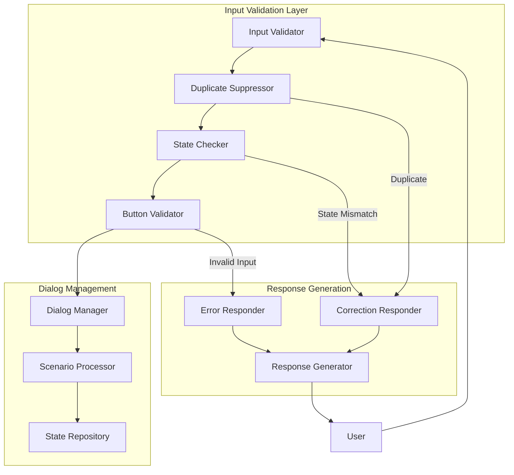

# Bot Management Input Validation Technical Specification

**Version**: 1.0  
**Date**: January 2025  
**Status**: Draft  

## Overview

This specification defines a comprehensive input validation system for bot management to handle duplicate button clicks, invalid inputs, and edge cases that can cause scenarios to malfunction or skip steps unexpectedly.

## Problem Statement

### Current Issues

1. **Duplicate Button Clicks**: Users can click the same button multiple times rapidly, causing:
   - Scenario steps to be processed multiple times
   - Premature scenario completion
   - Data corruption in collected variables
   - Unexpected dialog state transitions

2. **Invalid Input Handling**: Current system lacks robust validation for:
   - Button values that don't match expected options
   - Text input when buttons are expected
   - Malformed callback data
   - State desynchronization between client and server

3. **Race Conditions**: Concurrent requests from the same user can cause:
   - Inconsistent dialog state updates
   - Lost or duplicate data collection
   - Scenario flow interruptions

## Solution Architecture

### Core Components



## Technical Implementation

### 1. Input Validation Controller

```python
# src/bot_manager/input_validator.py

from typing import Dict, Any, Optional, List, Tuple
from enum import Enum
from dataclasses import dataclass
from datetime import datetime, timedelta
import asyncio
import hashlib

class InputType(Enum):
    BUTTON_CLICK = "button_click"
    TEXT_MESSAGE = "text_message"
    MEDIA_MESSAGE = "media_message"
    COMMAND = "command"

class ValidationResult(Enum):
    VALID = "valid"
    DUPLICATE = "duplicate"
    INVALID_BUTTON = "invalid_button"
    WRONG_INPUT_TYPE = "wrong_input_type"
    STATE_MISMATCH = "state_mismatch"
    RATE_LIMITED = "rate_limited"

@dataclass
class ValidationContext:
    user_id: str
    bot_id: str
    platform: str
    platform_chat_id: str
    input_type: InputType
    input_value: Any
    expected_buttons: Optional[List[Dict[str, Any]]]
    current_step: str
    dialog_state: Dict[str, Any]
    timestamp: datetime

@dataclass
class ValidationResponse:
    result: ValidationResult
    is_valid: bool
    error_message: Optional[str] = None
    correction_message: Optional[str] = None
    should_retry_current_step: bool = False
    suggested_buttons: Optional[List[Dict[str, Any]]] = None

class InputValidator:
    def __init__(self, redis_client=None, duplicate_window_seconds: int = 2):
        self.redis_client = redis_client
        self.duplicate_window = duplicate_window_seconds
        self.duplicate_cache = {}  # Fallback for development
        
    async def validate_input(self, context: ValidationContext) -> ValidationResponse:
        """
        Main validation entry point.
        Performs comprehensive input validation.
        """
        # 1. Check for duplicate submissions
        duplicate_check = await self._check_duplicate_submission(context)
        if duplicate_check.result == ValidationResult.DUPLICATE:
            return duplicate_check
            
        # 2. Check rate limiting
        rate_check = await self._check_rate_limit(context)
        if rate_check.result == ValidationResult.RATE_LIMITED:
            return rate_check
            
        # 3. Validate dialog state consistency
        state_check = await self._validate_dialog_state(context)
        if state_check.result == ValidationResult.STATE_MISMATCH:
            return state_check
            
        # 4. Validate input type and content
        input_check = await self._validate_input_content(context)
        if input_check.result != ValidationResult.VALID:
            return input_check
            
        # 5. Record successful validation
        await self._record_valid_input(context)
        
        return ValidationResponse(
            result=ValidationResult.VALID,
            is_valid=True
        )
    
    async def _check_duplicate_submission(
        self, 
        context: ValidationContext
    ) -> ValidationResponse:
        """
        Check if this input is a duplicate of a recent submission.
        Uses content hash + timing to detect duplicates.
        """
        # Create unique key for this input
        input_hash = self._create_input_hash(context)
        cache_key = f"input:{context.bot_id}:{context.user_id}:{input_hash}"
        
        # Check if we've seen this input recently
        if self.redis_client:
            last_seen = await self.redis_client.get(cache_key)
            if last_seen:
                last_timestamp = datetime.fromisoformat(last_seen.decode())
                if context.timestamp - last_timestamp < timedelta(seconds=self.duplicate_window):
                    return ValidationResponse(
                        result=ValidationResult.DUPLICATE,
                        is_valid=False,
                        correction_message="⚠️ Please wait a moment before clicking again.",
                        should_retry_current_step=False
                    )
        else:
            # Fallback for development
            if cache_key in self.duplicate_cache:
                last_timestamp = self.duplicate_cache[cache_key]
                if context.timestamp - last_timestamp < timedelta(seconds=self.duplicate_window):
                    return ValidationResponse(
                        result=ValidationResult.DUPLICATE,
                        is_valid=False,
                        correction_message="⚠️ Please wait a moment before clicking again.",
                        should_retry_current_step=False
                    )
        
        return ValidationResponse(result=ValidationResult.VALID, is_valid=True)
    
    async def _check_rate_limit(self, context: ValidationContext) -> ValidationResponse:
        """
        Check if user is sending inputs too frequently.
        """
        rate_key = f"rate:{context.bot_id}:{context.user_id}"
        max_requests_per_minute = 30
        
        if self.redis_client:
            current_count = await self.redis_client.incr(rate_key)
            if current_count == 1:
                await self.redis_client.expire(rate_key, 60)  # 1 minute window
            
            if current_count > max_requests_per_minute:
                return ValidationResponse(
                    result=ValidationResult.RATE_LIMITED,
                    is_valid=False,
                    correction_message="⚠️ You're sending messages too quickly. Please slow down.",
                    should_retry_current_step=False
                )
        
        return ValidationResponse(result=ValidationResult.VALID, is_valid=True)
    
    async def _validate_dialog_state(
        self, 
        context: ValidationContext
    ) -> ValidationResponse:
        """
        Validate that the dialog state is consistent and expected.
        """
        # Check if dialog state exists
        if not context.dialog_state:
            return ValidationResponse(
                result=ValidationResult.STATE_MISMATCH,
                is_valid=False,
                error_message="Dialog state not found",
                correction_message="Let's start over. Please use /start to begin.",
                should_retry_current_step=False
            )
        
        # Check if current step matches expected step
        if not context.current_step:
            return ValidationResponse(
                result=ValidationResult.STATE_MISMATCH,
                is_valid=False,
                error_message="Current step not defined",
                correction_message="Something went wrong. Let me help you continue.",
                should_retry_current_step=True
            )
        
        return ValidationResponse(result=ValidationResult.VALID, is_valid=True)
    
    async def _validate_input_content(
        self, 
        context: ValidationContext
    ) -> ValidationResponse:
        """
        Validate the actual input content against expected format.
        """
        if context.input_type == InputType.BUTTON_CLICK:
            return await self._validate_button_input(context)
        elif context.input_type == InputType.TEXT_MESSAGE:
            return await self._validate_text_input(context)
        elif context.input_type == InputType.COMMAND:
            return await self._validate_command_input(context)
        
        return ValidationResponse(result=ValidationResult.VALID, is_valid=True)
    
    async def _validate_button_input(
        self, 
        context: ValidationContext
    ) -> ValidationResponse:
        """
        Validate button click against expected buttons for current step.
        """
        if not context.expected_buttons:
            # No buttons expected, but button was clicked
            return ValidationResponse(
                result=ValidationResult.WRONG_INPUT_TYPE,
                is_valid=False,
                correction_message="Please send a text message instead of clicking a button.",
                should_retry_current_step=True
            )
        
        # Check if clicked button value is in expected buttons
        button_values = [btn.get('value') for btn in context.expected_buttons]
        if context.input_value not in button_values:
            # Create user-friendly button list
            button_texts = [btn.get('text', btn.get('value', 'Unknown')) 
                           for btn in context.expected_buttons]
            
            return ValidationResponse(
                result=ValidationResult.INVALID_BUTTON,
                is_valid=False,
                correction_message=f"Please choose one of these options: {', '.join(button_texts)}",
                should_retry_current_step=True,
                suggested_buttons=context.expected_buttons
            )
        
        return ValidationResponse(result=ValidationResult.VALID, is_valid=True)
    
    async def _validate_text_input(
        self, 
        context: ValidationContext
    ) -> ValidationResponse:
        """
        Validate text input when text is expected.
        """
        if context.expected_buttons:
            # Buttons are expected, but text was provided
            button_texts = [btn.get('text', btn.get('value', 'Unknown')) 
                           for btn in context.expected_buttons]
            
            return ValidationResponse(
                result=ValidationResult.WRONG_INPUT_TYPE,
                is_valid=False,
                correction_message=f"Please click one of these buttons: {', '.join(button_texts)}",
                should_retry_current_step=True,
                suggested_buttons=context.expected_buttons
            )
        
        # Additional text validation can be added here
        # (length, format, content rules, etc.)
        
        return ValidationResponse(result=ValidationResult.VALID, is_valid=True)
    
    async def _validate_command_input(
        self, 
        context: ValidationContext
    ) -> ValidationResponse:
        """
        Validate command input (like /start, /help).
        Commands are generally always valid and can interrupt flows.
        """
        return ValidationResponse(result=ValidationResult.VALID, is_valid=True)
    
    def _create_input_hash(self, context: ValidationContext) -> str:
        """
        Create a hash of the input content for duplicate detection.
        """
        content = f"{context.input_type.value}:{context.input_value}:{context.current_step}"
        return hashlib.md5(content.encode()).hexdigest()[:16]
    
    async def _record_valid_input(self, context: ValidationContext):
        """
        Record this input as processed to prevent duplicates.
        """
        input_hash = self._create_input_hash(context)
        cache_key = f"input:{context.bot_id}:{context.user_id}:{input_hash}"
        
        if self.redis_client:
            await self.redis_client.setex(
                cache_key, 
                self.duplicate_window, 
                context.timestamp.isoformat()
            )
        else:
            # Fallback for development
            self.duplicate_cache[cache_key] = context.timestamp
            
            # Clean old entries periodically
            cutoff = context.timestamp - timedelta(seconds=self.duplicate_window * 2)
            self.duplicate_cache = {
                k: v for k, v in self.duplicate_cache.items() 
                if v > cutoff
            }
```

### 2. Integration with Dialog Manager

```python
# src/bot_manager/dialog_manager.py (additions)

from src.bot_manager.input_validator import InputValidator, ValidationContext, InputType, ValidationResult

class DialogManager:
    def __init__(self, db: AsyncSession, redis_client=None):
        # ... existing initialization
        self.input_validator = InputValidator(redis_client)
    
    async def process_incoming_message(
        self,
        bot_id: UUID,
        platform: str,
        platform_chat_id: str,
        message_data: Dict[str, Any],
        adapter: PlatformAdapter
    ) -> Dict[str, Any]:
        """
        Enhanced message processing with input validation.
        """
        try:
            # Get current dialog state
            dialog_state = await self.state_repository.get_dialog_state(
                bot_id, platform, platform_chat_id
            )
            
            # Determine input type and value
            input_type, input_value = self._extract_input_details(message_data)
            
            # Get current scenario step info for validation
            scenario_info = await self._get_current_step_info(dialog_state, bot_id)
            
            # Create validation context
            validation_context = ValidationContext(
                user_id=platform_chat_id,
                bot_id=str(bot_id),
                platform=platform,
                platform_chat_id=platform_chat_id,
                input_type=input_type,
                input_value=input_value,
                expected_buttons=scenario_info.get('expected_buttons'),
                current_step=dialog_state.get('current_step', ''),
                dialog_state=dialog_state,
                timestamp=datetime.utcnow()
            )
            
            # Validate input
            validation_result = await self.input_validator.validate_input(validation_context)
            
            if not validation_result.is_valid:
                return await self._handle_invalid_input(
                    validation_result, adapter, platform_chat_id, scenario_info
                )
            
            # Input is valid, proceed with normal processing
            return await self._process_valid_input(
                bot_id, platform, platform_chat_id, message_data, adapter, dialog_state
            )
            
        except Exception as e:
            logger.error(f"Error in message processing: {str(e)}", exc_info=True)
            # Send user-friendly error message
            await adapter.send_text_message(
                platform_chat_id,
                "Sorry, something went wrong. Please try again or use /start to restart."
            )
            return {"status": "error", "message": str(e)}
    
    async def _handle_invalid_input(
        self,
        validation_result: ValidationResponse,
        adapter: PlatformAdapter,
        platform_chat_id: str,
        scenario_info: Dict[str, Any]
    ) -> Dict[str, Any]:
        """
        Handle invalid input by sending appropriate correction message.
        """
        response_sent = False
        
        if validation_result.result == ValidationResult.DUPLICATE:
            # For duplicates, we might not want to send any response
            # to avoid spamming the user
            logger.info(f"Duplicate input detected for {platform_chat_id}")
            return {"status": "duplicate", "action": "ignored"}
            
        elif validation_result.correction_message:
            # Send correction message
            if validation_result.suggested_buttons:
                await adapter.send_buttons(
                    platform_chat_id,
                    validation_result.correction_message,
                    validation_result.suggested_buttons
                )
                response_sent = True
            else:
                await adapter.send_text_message(
                    platform_chat_id,
                    validation_result.correction_message
                )
                response_sent = True
        
        if validation_result.should_retry_current_step and not response_sent:
            # Re-send current step message
            await self._resend_current_step(adapter, platform_chat_id, scenario_info)
        
        return {
            "status": "invalid_input",
            "validation_result": validation_result.result.value,
            "action": "correction_sent"
        }
    
    def _extract_input_details(self, message_data: Dict[str, Any]) -> Tuple[InputType, Any]:
        """
        Extract input type and value from message data.
        """
        if message_data.get('callback_query'):
            return InputType.BUTTON_CLICK, message_data['callback_query'].get('data')
        elif message_data.get('text', '').startswith('/'):
            return InputType.COMMAND, message_data.get('text')
        elif 'photo' in message_data or 'document' in message_data or 'video' in message_data:
            return InputType.MEDIA_MESSAGE, message_data
        else:
            return InputType.TEXT_MESSAGE, message_data.get('text', '')
    
    async def _get_current_step_info(
        self, 
        dialog_state: Dict[str, Any], 
        bot_id: UUID
    ) -> Dict[str, Any]:
        """
        Get information about the current scenario step including expected buttons.
        """
        current_step = dialog_state.get('current_step')
        if not current_step:
            return {}
        
        # Get scenario data
        scenario = await self._get_bot_scenario(bot_id)
        if not scenario or 'steps' not in scenario:
            return {}
        
        step_data = scenario['steps'].get(current_step, {})
        
        # Extract expected buttons if any
        expected_buttons = None
        if 'buttons' in step_data:
            expected_buttons = step_data['buttons']
        elif 'response' in step_data and isinstance(step_data['response'], dict):
            expected_buttons = step_data['response'].get('buttons')
        
        return {
            'step_data': step_data,
            'expected_buttons': expected_buttons,
            'step_id': current_step
        }
    
    async def _resend_current_step(
        self,
        adapter: PlatformAdapter,
        platform_chat_id: str,
        scenario_info: Dict[str, Any]
    ):
        """
        Re-send the current step message to guide user back on track.
        """
        step_data = scenario_info.get('step_data', {})
        
        if 'response' in step_data:
            response_data = step_data['response']
            if isinstance(response_data, dict):
                text = response_data.get('text', 'Please choose an option:')
                buttons = response_data.get('buttons')
                
                if buttons:
                    await adapter.send_buttons(platform_chat_id, text, buttons)
                else:
                    await adapter.send_text_message(platform_chat_id, text)
            else:
                await adapter.send_text_message(platform_chat_id, str(response_data))
        else:
            await adapter.send_text_message(
                platform_chat_id,
                "Please continue with the current step."
            )
```

### 3. Configuration and Settings

```python
# src/api/core/bot_validation_config.py

from typing import Dict, Any
from pydantic import BaseModel

class InputValidationConfig(BaseModel):
    # Duplicate detection
    duplicate_window_seconds: int = 2
    duplicate_cache_ttl: int = 10
    
    # Rate limiting
    max_requests_per_minute: int = 30
    rate_limit_window_seconds: int = 60
    
    # Button validation
    strict_button_validation: bool = True
    allow_case_insensitive_buttons: bool = False
    
    # Text validation
    max_text_length: int = 4000
    min_text_length: int = 0
    
    # Error messages
    duplicate_message: str = "⚠️ Please wait a moment before clicking again."
    rate_limit_message: str = "⚠️ You're sending messages too quickly. Please slow down."
    invalid_button_message: str = "Please choose one of the available options."
    wrong_input_type_message: str = "Please provide the correct type of input."
    
    # Behavior settings
    ignore_duplicates: bool = True  # Don't respond to duplicates
    resend_step_on_invalid: bool = True
    log_validation_events: bool = True

# Default configuration
DEFAULT_VALIDATION_CONFIG = InputValidationConfig()

# Environment-specific configurations
VALIDATION_CONFIGS: Dict[str, InputValidationConfig] = {
    "development": InputValidationConfig(
        duplicate_window_seconds=1,
        max_requests_per_minute=60,
        log_validation_events=True
    ),
    "production": InputValidationConfig(
        duplicate_window_seconds=3,
        max_requests_per_minute=20,
        strict_button_validation=True,
        ignore_duplicates=True
    ),
    "testing": InputValidationConfig(
        duplicate_window_seconds=0.1,
        max_requests_per_minute=1000,
        log_validation_events=False
    )
}
```

## User Experience Design

### Error Messages

**Principle**: Always guide users back to the correct path with clear, friendly messages.

```python
ERROR_MESSAGES = {
    ValidationResult.DUPLICATE: {
        "message": "⚠️ I got your click! Please wait a moment.",
        "action": "ignore",  # Don't resend current step
        "delay": 0
    },
    ValidationResult.INVALID_BUTTON: {
        "message": "Please choose one of these options:",
        "action": "resend_with_buttons",
        "delay": 0
    },
    ValidationResult.WRONG_INPUT_TYPE: {
        "message": "I was expecting you to click a button. Let me show you the options:",
        "action": "resend_current_step",
        "delay": 0
    },
    ValidationResult.STATE_MISMATCH: {
        "message": "Something seems out of sync. Let me help you continue:",
        "action": "resend_current_step",
        "delay": 0
    },
    ValidationResult.RATE_LIMITED: {
        "message": "⚠️ You're going too fast! Please slow down a bit.",
        "action": "ignore",
        "delay": 2
    }
}
```

### Progressive Enhancement

1. **Graceful Degradation**: System works even if validation fails
2. **Context Preservation**: User's progress is never lost
3. **Clear Communication**: Users always know what to do next
4. **Minimal Friction**: Valid inputs are processed immediately

## Implementation Plan

### Phase 1: Core Validation (Week 1)
- [ ] Implement `InputValidator` class
- [ ] Add duplicate detection with Redis
- [ ] Basic button validation
- [ ] Integration with existing `DialogManager`

### Phase 2: Enhanced Features (Week 2)
- [ ] Rate limiting implementation
- [ ] State consistency checks
- [ ] Comprehensive error messages
- [ ] User experience improvements

### Phase 3: Testing & Optimization (Week 3)
- [ ] Unit tests for all validation scenarios
- [ ] Integration tests with real bot flows
- [ ] Performance optimization
- [ ] Error message localization

### Phase 4: Monitoring & Analytics (Week 4)
- [ ] Validation event logging
- [ ] Metrics collection
- [ ] Dashboard for validation statistics
- [ ] Alert system for high error rates

## Testing Strategy

### Unit Tests

```python
# src/api/tests/unit/test_input_validator.py

import pytest
from datetime import datetime, timedelta
from src.bot_manager.input_validator import (
    InputValidator, ValidationContext, InputType, ValidationResult
)

class TestInputValidator:
    
    @pytest.fixture
    def validator(self):
        return InputValidator(duplicate_window_seconds=2)
    
    @pytest.fixture
    def base_context(self):
        return ValidationContext(
            user_id="test_user",
            bot_id="test_bot",
            platform="telegram",
            platform_chat_id="12345",
            input_type=InputType.BUTTON_CLICK,
            input_value="option_1",
            expected_buttons=[
                {"text": "Option 1", "value": "option_1"},
                {"text": "Option 2", "value": "option_2"}
            ],
            current_step="step_1",
            dialog_state={"current_step": "step_1"},
            timestamp=datetime.utcnow()
        )
    
    async def test_valid_button_input(self, validator, base_context):
        result = await validator.validate_input(base_context)
        assert result.is_valid
        assert result.result == ValidationResult.VALID
    
    async def test_invalid_button_value(self, validator, base_context):
        base_context.input_value = "invalid_option"
        result = await validator.validate_input(base_context)
        assert not result.is_valid
        assert result.result == ValidationResult.INVALID_BUTTON
        assert "Please choose one of these options" in result.correction_message
    
    async def test_duplicate_detection(self, validator, base_context):
        # First input should be valid
        result1 = await validator.validate_input(base_context)
        assert result1.is_valid
        
        # Immediate duplicate should be rejected
        base_context.timestamp = datetime.utcnow()
        result2 = await validator.validate_input(base_context)
        assert not result2.is_valid
        assert result2.result == ValidationResult.DUPLICATE
    
    async def test_duplicate_after_window(self, validator, base_context):
        # First input
        result1 = await validator.validate_input(base_context)
        assert result1.is_valid
        
        # After duplicate window, should be valid again
        base_context.timestamp = datetime.utcnow() + timedelta(seconds=3)
        result2 = await validator.validate_input(base_context)
        assert result2.is_valid
    
    async def test_wrong_input_type(self, validator, base_context):
        # Expecting buttons but got text
        base_context.input_type = InputType.TEXT_MESSAGE
        base_context.input_value = "some text"
        
        result = await validator.validate_input(base_context)
        assert not result.is_valid
        assert result.result == ValidationResult.WRONG_INPUT_TYPE
        assert result.should_retry_current_step
```

### Integration Tests

```python
# src/api/tests/integration/test_bot_input_validation.py

import pytest
from src.bot_manager.dialog_manager import DialogManager
from src.integrations.platforms.telegram_adapter import TelegramAdapter

class TestBotInputValidation:
    
    async def test_duplicate_button_click_scenario(self, dialog_manager, mock_adapter):
        """Test that duplicate button clicks don't advance scenario"""
        bot_id = "test_bot"
        platform_chat_id = "12345"
        
        # First button click
        message_data = {
            "callback_query": {"data": "start_process"}
        }
        
        result1 = await dialog_manager.process_incoming_message(
            bot_id, "telegram", platform_chat_id, message_data, mock_adapter
        )
        assert result1["status"] == "success"
        
        # Immediate duplicate click
        result2 = await dialog_manager.process_incoming_message(
            bot_id, "telegram", platform_chat_id, message_data, mock_adapter
        )
        assert result2["status"] == "duplicate"
        
        # Verify scenario didn't advance twice
        dialog_state = await dialog_manager.state_repository.get_dialog_state(
            bot_id, "telegram", platform_chat_id
        )
        # Assert current step is correct and not advanced
    
    async def test_invalid_button_handling(self, dialog_manager, mock_adapter):
        """Test handling of invalid button values"""
        bot_id = "test_bot"
        platform_chat_id = "12345"
        
        # Invalid button click
        message_data = {
            "callback_query": {"data": "nonexistent_option"}
        }
        
        result = await dialog_manager.process_incoming_message(
            bot_id, "telegram", platform_chat_id, message_data, mock_adapter
        )
        
        assert result["status"] == "invalid_input"
        assert result["validation_result"] == "invalid_button"
        
        # Verify correction message was sent
        assert mock_adapter.send_buttons.called
        correction_call = mock_adapter.send_buttons.call_args
        assert "choose one of these options" in correction_call[0][1].lower()
```

## Monitoring and Metrics

### Key Metrics to Track

1. **Validation Events**
   - Total validations per hour
   - Validation failure rate by type
   - Most common invalid inputs

2. **User Experience**
   - Average duplicate clicks per user
   - Time spent in correction loops
   - Scenario completion rates before/after validation

3. **System Performance**
   - Validation latency
   - Redis cache hit rates
   - Memory usage of duplicate detection

### Logging Structure

```python
# Validation event log format
{
    "timestamp": "2025-01-13T10:30:00Z",
    "event_type": "input_validation",
    "bot_id": "bot_123",
    "user_id": "user_456",
    "platform": "telegram",
    "validation_result": "invalid_button",
    "input_type": "button_click",
    "input_value": "wrong_option",
    "expected_values": ["option_1", "option_2"],
    "current_step": "step_2",
    "response_time_ms": 15,
    "correction_sent": true
}
```

## Security Considerations

### Input Sanitization
- Validate all input lengths
- Sanitize text inputs to prevent injection
- Validate button values against whitelist

### Rate Limiting
- Prevent abuse through excessive requests
- Implement progressive penalties
- Monitor for suspicious patterns

### State Protection
- Encrypt sensitive dialog state data
- Validate state integrity
- Prevent state manipulation attacks

## Performance Optimization

### Caching Strategy
- Use Redis for duplicate detection
- Cache validation rules per scenario
- Implement LRU eviction for memory management

### Async Processing
- Non-blocking validation checks
- Parallel validation of multiple criteria
- Efficient database queries

### Resource Management
- Limit memory usage of duplicate detection
- Clean up expired validation records
- Monitor Redis memory usage

## Migration Strategy

### Backward Compatibility
- Gradual rollout with feature flags
- Support for legacy input handling
- Monitoring during transition period

### Rollback Plan
- Quick disable mechanism
- Fallback to original processing
- Data consistency preservation

## Success Criteria

### Functional Requirements
- ✅ 99%+ duplicate detection accuracy
- ✅ <50ms validation latency
- ✅ Zero scenario state corruption
- ✅ Improved user experience scores

### Quality Requirements
- ✅ 95%+ test coverage
- ✅ Clear error messages for all scenarios
- ✅ Comprehensive monitoring
- ✅ Production stability

## Related Documentation

- **[Input Validation Overview](input-validation-overview.md)** - User-friendly introduction to input validation features
- **[Bot Management Overview](overview.md)** - Complete system architecture and integration details
- **[DialogManager Implementation](../../src/bot_manager/dialog_manager.py)** - See validation integration code
- **[MediaManager](media-manager.md)** - Related component for media processing
- **[Refactoring Plan](refactoring-plan.md)** - Implementation status and achievements

## Conclusion

This input validation system will significantly improve the reliability and user experience of the bot management system by:

1. **Preventing Duplicate Processing**: Eliminating race conditions and duplicate button clicks
2. **Providing Clear Guidance**: Helping users stay on the correct path with friendly error messages
3. **Maintaining State Integrity**: Ensuring dialog states remain consistent and valid
4. **Improving System Reliability**: Reducing unexpected errors and edge cases

The implementation follows clean architecture principles, includes comprehensive testing, and provides monitoring capabilities for ongoing optimization.