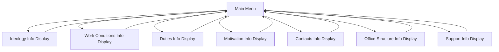

# Bot Menu Navigation System Technical Specification

**Version**: 1.0  
**Date**: January 2025  
**Status**: Draft  

## Overview

This specification defines a simplified menu navigation system for bot scenarios that allows users to quickly access information and return directly to the menu without getting trapped in onboarding flows. The focus is on **Quick Information Access** - showing essential information in a single step with direct menu return.

## Problem Statement

### Current Issues

1. **Menu Navigation Loops**: Menu options redirect to onboarding flow steps that eventually lead back to the full onboarding process instead of returning to the menu.

2. **No Quick Access**: Users cannot quickly view essential information without going through long sequential flows.

3. **Poor Reference Experience**: Users who want to quickly check company policies, contact details, or work conditions get trapped in onboarding flows.

### Example of Current Problem

```json
"menu": {
  "next_step": {
    "conditions": [
      {
        "if": "menu_choice == 'ideology'",
        "then": "company_intro"  // Goes to onboarding flow!
      }
    ]
  }
}
```

Where `company_intro` is designed for onboarding and leads to `company_positioning` → `company_values` → ... → eventually back to full onboarding.

## Solution Architecture

### Core Concept: Quick Information Access

**Simple Principle**: Each menu option leads to a single information display step that shows essential information and returns directly to menu.

### Architecture Diagram



## Technical Implementation

### Information Display Steps

Create dedicated information display steps that show essential information with direct menu return:

```json
{
  "menu_ideology_display": {
    "id": "menu_ideology_display",
    "type": "message",
    "message": {
      "text": "🏮 Идеология Чихо\n\nЧихо - это молодежный бренд повседневности.\nBIG IDEA: Помогаем быть. Не норм. А собой.\n\nНаши ценности:\n• Подлинность #НАСТОЯЩЕСТЬ\n• Творчество и креативность\n• Юмор против пафоса\n• Комьюнити - наше всё",
      "media": [
        {
          "type": "image",
          "description": "Ценности компании",
          "file_id": "chiho-values-summary"
        }
      ]
    },
    "buttons": [
      {"text": "⬅️ Главное меню", "value": "back_to_menu"}
    ],
    "expected_input": {
      "type": "button",
      "variable": "user_action"
    },
    "next_step": "menu"
  }
}
```

### Updated Menu Step

Update menu to redirect to information display steps:

```json
{
  "menu": {
    "id": "menu",
    "type": "message",
    "message": {
      "text": "Главное меню"
    },
    "buttons": [
      {"text": "🏮 Идеология", "value": "ideology"},
      {"text": "📋 Условия работы", "value": "work_conditions_menu"},
      {"text": "💪 Обязанности", "value": "duties"},
      {"text": "💰 Мотивационная программа", "value": "motivation"},
      {"text": "📞 Контакты", "value": "contacts"},
      {"text": "🏢 Оргструктура офиса", "value": "office_structure"},
      {"text": "🆘 Поддержка", "value": "support"}
    ],
    "expected_input": {
      "type": "button",
      "variable": "menu_choice"
    },
    "next_step": {
      "type": "conditional",
      "conditions": [
        {
          "if": "menu_choice == 'ideology'",
          "then": "menu_ideology_display"
        },
        {
          "if": "menu_choice == 'work_conditions_menu'",
          "then": "menu_work_conditions_display"
        },
        {
          "if": "menu_choice == 'duties'",
          "then": "menu_duties_display"
        },
        {
          "if": "menu_choice == 'motivation'",
          "then": "menu_motivation_display"
        },
        {
          "if": "menu_choice == 'contacts'",
          "then": "menu_contacts"
        },
        {
          "if": "menu_choice == 'office_structure'",
          "then": "menu_office_structure_display"
        },
        {
          "if": "menu_choice == 'support'",
          "then": "menu_support"
        }
      ]
    }
  }
}
```

### Complete Information Display Steps

All menu options lead to simple information display steps:

```json
{
  "menu_work_conditions_display": {
    "id": "menu_work_conditions_display",
    "type": "message",
    "message": {
      "text": "📋 Условия работы\n\n• График: плавающий, учитываем пожелания\n• ЗП: 1 грейд - 280₽/час, 2 грейд - 320₽/час\n• Выплаты: 2 раза в месяц (15-17 и 25-30)\n• Премия: зависит от KPI команды\n• Дополнительно: Фитмост, БестБенефитс\n• ЛМК: первая за счет сотрудника (~5000₽), продление за счет компании"
    },
    "buttons": [
      {"text": "⬅️ Главное меню", "value": "back_to_menu"}
    ],
    "expected_input": {
      "type": "button",
      "variable": "user_action"
    },
    "next_step": "menu"
  },

  "menu_duties_display": {
    "id": "menu_duties_display",
    "type": "message",
    "message": {
      "text": "💪 Обязанности фуд-гида\n\nПервичные (каждый день):\n• Прием заказов и консультации гостей\n• Поддержание чистоты зала и кассовой зоны\n• Соблюдение стандартов сервиса\n• Работа с кассой и расчеты\n\nВторичные (бонусные задания):\n• Помощь на кухне при необходимости\n• Участие в акциях и промо\n• Обучение новых сотрудников"
    },
    "buttons": [
      {"text": "⬅️ Главное меню", "value": "back_to_menu"}
    ],
    "expected_input": {
      "type": "button",
      "variable": "user_action"
    },
    "next_step": "menu"
  }
}
```

## Content Organization

### Simple Information Display

Each menu option shows essential information in a single, self-contained step:

| Menu Option | Information Displayed |
|-------------|---------------------|
| 🏮 Идеология | Company values, positioning, BIG IDEA |
| 📋 Условия работы | Pay rates, schedule, benefits, medical book |
| 💪 Обязанности | Primary & secondary duties breakdown |
| 💰 Мотивационная программа | KPI overview, bonuses, premium calculation |
| 📞 Контакты | Support contacts & chat links |
| 🏢 Оргструктура офиса | Key people, office locations |
| 🆘 Поддержка | Help message form (existing functionality) |

## User Experience Design

### Navigation Principles

1. **Quick Access**: Essential information available in exactly 2 clicks from menu
2. **Immediate Return**: Every information display returns directly to menu
3. **No Dead Ends**: Users can never get trapped in flows
4. **Consistent Pattern**: All menu options work the same way

### Button Standards

All information display steps use the same button pattern:

```json
{
  "buttons": [
    {"text": "⬅️ Главное меню", "value": "back_to_menu"}
  ],
  "next_step": "menu"
}
```

## Implementation Strategy 

### Single Phase Implementation (1-2 days)

1. **Create Information Display Steps**
   - [ ] Create `menu_ideology_display` with company values summary
   - [ ] Create `menu_work_conditions_display` with pay/schedule info
   - [ ] Create `menu_duties_display` with responsibilities breakdown  
   - [ ] Create `menu_motivation_display` with KPI/bonus summary
   - [ ] Create `menu_office_structure_display` with key people/locations

2. **Update Menu Navigation**
   - [ ] Update menu step to redirect to new display steps
   - [ ] Test all menu → info → menu flows
   - [ ] Verify no onboarding loops remain

3. **Content Migration**
   - [ ] Extract key information from existing onboarding steps
   - [ ] Condense into essential bullet points
   - [ ] Add relevant media where helpful

## Testing Strategy

### Simple Flow Testing

**Test Case: Quick Information Access**
1. User reaches menu after onboarding
2. Clicks any menu option (e.g., "📋 Условия работы")
3. Sees information display with summary
4. Clicks "⬅️ Главное меню"
5. **Verify**: Returns to menu, never enters onboarding flow

**Test All Menu Options**:
- 🏮 Идеология → menu_ideology_display → menu
- 📋 Условия работы → menu_work_conditions_display → menu  
- 💪 Обязанности → menu_duties_display → menu
- 💰 Мотивационная программа → menu_motivation_display → menu
- 🏢 Оргструктура офиса → menu_office_structure_display → menu

## Success Criteria

### User Experience Goals
- ✅ **2-click access** to any information (menu → info → back)
- ✅ **No onboarding loops** from menu navigation  
- ✅ **Immediate information** without complex flows
- ✅ **Consistent behavior** across all menu options

### Technical Requirements
- ✅ All menu options redirect to dedicated display steps
- ✅ All display steps return directly to menu
- ✅ No complex conditional navigation
- ✅ Information is complete and self-contained

## Related Documentation

- **[Bot Scenario Format](scenario-format.md)** - Basic scenario structure and conditional navigation
- **[Input Validation Overview](input-validation-overview.md)** - Button validation for menu navigation
- **[Intent-Based Scenarios Spec](intent-based-scenarios-spec.md)** - Modular architecture for complex scenarios
- **[Auto-Transitions](auto-transitions.md)** - Automated flow control in content sections
- **[Conversation Logging](conversation-logging.md)** - Analytics and debugging for menu usage

## Conclusion

This simplified menu navigation system solves the core problem: **users getting trapped in onboarding flows when they just want to quickly reference information**.

### The Solution
- **Simple Pattern**: Menu → Information Display → Menu
- **No Complexity**: Each information step shows everything needed and returns to menu
- **Quick Access**: Essential information in exactly 2 clicks
- **No Dead Ends**: Users can never get lost in complex flows

### Implementation
This system requires minimal changes:
1. Create dedicated `menu_[section]_display` steps with essential information
2. Update menu to redirect to these display steps  
3. Each display step has one button: "⬅️ Главное меню" → menu

The result is a user-friendly reference system that preserves the detailed onboarding flow while providing quick access to key information without navigation loops.